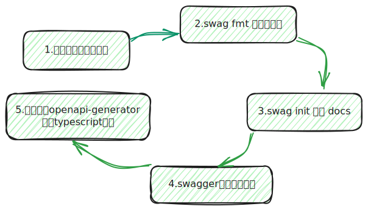

#### 准备工作

* 安装swagger cli（用与格式化注释以及生成swagger json文件）

```she
go get -u github.com/swaggo/swag/cmd/swag
```

* mac中安装后需要将swag移动到下面的路径下，确保shell中swag命令全局可用：

```she
sudo mv $GOPATH/bin/swag /usr/local/go/bin
```

* 检测是否成功安装

```she
swag -v
```

* 其他扩展文件安装

```she
go get -u -v github.com/swaggo/gin-swagger # 集成 Swagger 文档到 Go 的 Gin 框架中的库
go get -u -v github.com/swaggo/files # Go 项目中集成 Swagger UI
go get -u -v github.com/alecthomas/template # Go 语言中用于文本和 HTML 模板处理的库
```

#### 使用流程



##### 注释

[官方文档](https://swagger.io/docs/specification/about/)

|   注解   |                             说明                             |
| :------: | :----------------------------------------------------------: |
| @Summary |                             摘要                             |
| @Produce |              生成的文档的MIME类型，json、xml等               |
|  @Param  | 参数，左=>右分别为：`参数名`、`入参类型`、`数据类型`、`是否必填`、`注释` |
| @Success |  响应成功，从左到右分别为：状态码、参数类型、数据类型、注释  |
| @Failure |  响应失败，从左到右分别为：状态码、参数类型、数据类型、注释  |
| @Router  |          路由，从左到右分别为：路由地址，HTTP 方法           |

代码示例

> Tips:  需要注意的是，注释中引用其他类型，比如model.Tool ，需要在Tool上添加注释，swag init才会自动做类型的关联，不然swag识别不了该写法

```go
// Tool represents a tool entity
// @Description Tool represents a tool entity
type Tool struct {
	ID       uint   `json:"id,omitempty" gorm:"column:id" swaggerignore:"true"`
	Category string `json:"category" gorm:"column:category"`
	Name     string `json:"name" gorm:"column:name"`
	Url      string `json:"url" gorm:"column:url"`
}
```


```go
//	@Summary	我的工具信息列表获取
//	@Produce	json
//	@Success	200	{object}	model.Tool	"请求成功"
//	@Failure	400	{string}	string		"请求错误"
//	@Failure	500	{string}	string		"内部错误"
//	@Router		/tool/list [get]
func (T ToolController) ToolListController(c *gin.Context) {
  // do something
}

//	@Summary	我的工具项新增
//	@Produce	json
//	@Param		tool	body		model.Tool	true	"Tool object to be added"
//	@Success	200		{object}	model.Tool	"成功"
//	@Failure	400		{object}	string		"请求错误"
//	@Failure	500		{object}	string		"内部错误"
//	@Router		/tool/add [post]
func (T ToolController) ToolAddController(c *gin.Context) {
  // do something
}
```

##### 格式化

```she
swag fmt # 会扫描该项目所有包含注释的方法，对注释进行格式化
```

##### 文档生成

swag init 扫描文件，一般都需要包含main.go，不然会报错，笔者项目main.go不在根目录下，所以需要手动指定swag扫描的文件，这里我们指定了，`./cmd/my_website_backend`该文件包含main.go，`./internal/app/controller`该文件中包含添加注释的控制器函数，`./internal/app/model`该文件包含数据模型映射的类型，注释中有时候需要引用该类型；最后`-o ./api/swagger`指定生成的文档存储在`./api/swagger`文件夹中

```go
swag init --dir ./cmd/my_website_backend,./internal/app/controller,./internal/app/model -o ./api/swagger
```

##### 文档路由添加

生成的文档需要有专门的路由进行展示，需要我们配置：

```go
package router

import (
	"github.com/gin-gonic/gin"
	swaggerFiles "github.com/swaggo/files"
	ginSwagger "github.com/swaggo/gin-swagger"
	_ "web_backend.com/m/v2/api/swagger" // 这里替换成swag init 生成后的go package 路径即可
)

// GenSwaggerRouters swagger页面路由
func GenSwaggerRouters(r *gin.Engine) {
	r.GET("/swagger/*any", ginSwagger.WrapHandler(swaggerFiles.Handler))
}

```

#### 前端接口文档自动生成

* 前后端对接接口，前端手动去添加typescript类型的话，费时费力
* 行业有这样一种解决方案，利用openApi规范，后端按规范写好json注释，我们利用提供的`openapi-generator`cli工具生成支持的任意类型的接口，避免重复声明类型
* 官方有现成的解决方案，行业内也有许多，咱们这里选用国内阿里开源的库[@umijs/openapi](https://github.com/chenshuai2144/openapi2typescript)去生成接口文档，更好的其他方式，可以自己去探索

##### 安装

```shell
pnpm add -D @umijs/openapi
```

##### 使用

* 博主这里是放在根目录下的script/genOpenApi.js文件中的

```javascript
import { generateService } from "@umijs/openapi";

generateService({
  schemaPath: "http://127.0.0.1:8001/swagger/doc.json", // swagger.json地址，按需修改
  serversPath: "src",// 生成后的文件路径，按需修改
});

```

* package.json scripts中添加生成的脚本命令，按自己需求更改

```shell
"openApi": "node script/genOpenApi.js"
```

##### 其他配置参照[官方文档](https://github.com/chenshuai2144/openapi2typescript)
